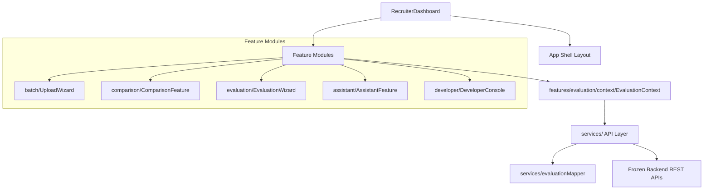

# TalentScout Enterprise Frontend Architecture

This document describes the modern frontend architecture of the TalentScout Enterprise Recruiter Command Center.

## Architecture Overview

The application follows a modular, feature-based architecture pattern. This design separates the core application orchestration shell from self-contained feature modules, network clients, state managers, and payload adapters.



---

## Folder Structure Guidelines

All React code resides in the `src/` directory, broken down by architectural layers:

```
src/
├── app/                  # Application bootstrap and providers
├── components/           # Common layout shells and reusable UI widgets
├── features/             # Self-contained feature modules
│   ├── assistant/        # AI RAG assistant chat feature
│   ├── batch/            # Ingest, batch queue, and file drop wizard
│   ├── comparison/       # Candidate score comparison matrix and side-by-side modal
│   └── evaluation/       # 5-step evaluation wizard steps
├── providers/            # Shared Context/State Providers (Theme, Toast)
├── services/             # API layer request wrapper and Mapper adapters
└── utils/                # General utility functions
```

---

## Core Boundaries and Rules

1. **Feature Separation**: Feature modules should be strictly encapsulated under `src/features/`. Cross-feature imports are restricted to shared state contexts (e.g. `EvaluationContext`).
2. **Adapter Purity**: Direct parsing of API response schemas inside components is prohibited. Network responses must pass through `evaluationMapper.js` to return a flat, safe, normalized UI model.
3. **No Direct Axios Usage in UI**: Components must interact with the network exclusively via service class handlers (e.g., `batchService`, `chatService`).
4. **State Delegation**: Keep ephemeral presentation states (e.g. active tab selections, dialog triggers) locally inside components. Push shared, domain-wide workflow states into `EvaluationContext`.
